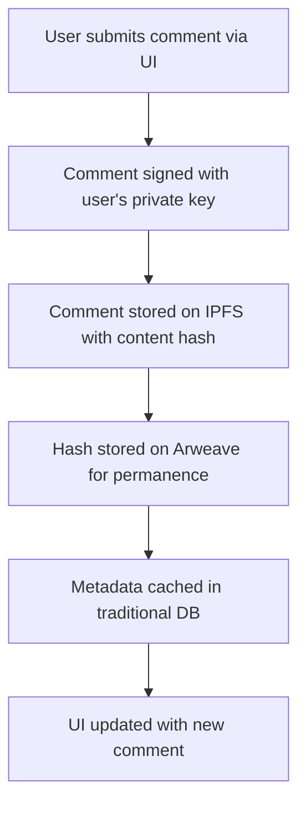
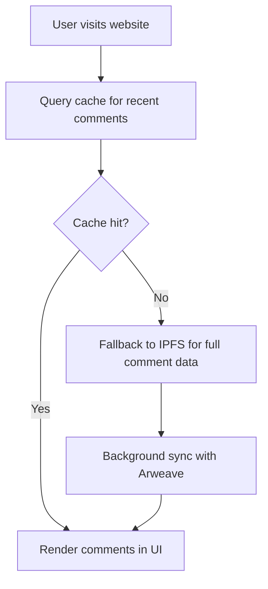

# 🏗️ Commentator Technical Architecture
## Scalable Decentralized Commenting System

### 🎯 Architecture Overview

Commentator is designed as a **decentralized, scalable commenting protocol** that operates across multiple layers to ensure performance, reliability, and censorship resistance.

---

## 🏛️ System Architecture

### High-Level Architecture Diagram

```
┌─────────────────────────────────────────────────────────────────┐
│                        USER INTERFACES                          │
├─────────────────┬─────────────────┬─────────────────────────────┤
│  Browser Ext    │   Web App      │      Mobile Apps            │
│  (Chrome/FF)    │   (React/JS)   │    (iOS/Android)            │
└─────────────────┴─────────────────┴─────────────────────────────┘
                                │
                                ▼
┌─────────────────────────────────────────────────────────────────┐
│                     API GATEWAY LAYER                          │
├─────────────────┬─────────────────┬─────────────────────────────┤
│   REST APIs     │   GraphQL      │    WebSocket               │
│   (Comments)    │   (Queries)    │    (Real-time)             │
└─────────────────┴─────────────────┴─────────────────────────────┘
                                │
                                ▼
┌─────────────────────────────────────────────────────────────────┐
│                   BUSINESS LOGIC LAYER                         │
├─────────────────┬─────────────────┬─────────────────────────────┤
│  Comment Svc    │  Identity Svc   │   Moderation Svc           │
│  (CRUD Ops)     │  (Web3 Auth)    │   (DAO Voting)             │
└─────────────────┴─────────────────┴─────────────────────────────┘
                                │
                                ▼
┌─────────────────────────────────────────────────────────────────┐
│                      DATA LAYER                                │
├─────────────────┬─────────────────┬─────────────────────────────┤
│   IPFS Storage  │   Arweave      │    Traditional DB           │
│   (Comments)    │   (Permanent)   │    (Metadata/Cache)        │
└─────────────────┴─────────────────┴─────────────────────────────┘
                                │
                                ▼
┌─────────────────────────────────────────────────────────────────┐
│                   INFRASTRUCTURE LAYER                         │
├─────────────────┬─────────────────┬─────────────────────────────┤
│   CDN Network   │   Load Balancer │    Monitoring/Logging      │
│   (Global)      │   (Auto-scale)  │    (Observability)         │
└─────────────────┴─────────────────┴─────────────────────────────┘
```

---

## 📱 Client Architecture

### Browser Extension
- **Manifest V3** compliance for Chrome/Firefox
- **Content Scripts** for website integration
- **Background Service Worker** for API communication
- **Popup Interface** for user interaction
- **Local Storage** for caching and offline capability

### Web Application
- **Progressive Web App** (PWA) with offline support
- **React/TypeScript** for maintainable UI
- **State Management** with Redux/Zustand
- **Service Worker** for caching and background sync
- **WebAssembly** for performance-critical operations

### Mobile Applications
- **React Native** for cross-platform development
- **Native modules** for platform-specific features
- **Offline-first** architecture with local storage
- **Push notifications** for comment updates
- **Biometric authentication** integration

---

## 🔧 Backend Architecture

### Microservices Design

#### 1. Comment Service
```typescript
interface CommentService {
  createComment(comment: Comment): Promise<CommentId>
  updateComment(id: CommentId, updates: Partial<Comment>): Promise<void>
  deleteComment(id: CommentId): Promise<void>
  getComments(url: string, filters?: CommentFilters): Promise<Comment[]>
  getCommentThread(id: CommentId): Promise<CommentThread>
}
```

#### 2. Identity Service
```typescript
interface IdentityService {
  authenticateWallet(signature: string): Promise<UserSession>
  resolveENS(address: string): Promise<ENSProfile>
  verifyIdentity(address: string): Promise<IdentityProof>
  getUserProfile(address: string): Promise<UserProfile>
}
```

#### 3. Moderation Service
```typescript
interface ModerationService {
  reportComment(commentId: CommentId, reason: string): Promise<ReportId>
  voteOnComment(commentId: CommentId, vote: Vote): Promise<void>
  getModerationQueue(): Promise<ModerationItem[]>
  executeModeration(action: ModerationAction): Promise<void>
}
```

### API Gateway
- **Rate Limiting** to prevent abuse
- **Authentication** middleware for protected routes
- **Request/Response** transformation
- **Circuit Breaker** for resilience
- **Caching** for frequently accessed data

---

## 🗄️ Data Architecture

### Decentralized Storage Strategy

#### IPFS Integration
```typescript
interface IPFSStorage {
  storeComment(comment: Comment): Promise<IPFSHash>
  retrieveComment(hash: IPFSHash): Promise<Comment>
  pinComment(hash: IPFSHash): Promise<void>
  createCommentIndex(url: string): Promise<IPFSHash>
}
```

#### Arweave Integration
```typescript
interface ArweaveStorage {
  permanentStore(data: any): Promise<ArweaveId>
  retrieve(id: ArweaveId): Promise<any>
  queryComments(url: string): Promise<ArweaveId[]>
  bundleComments(comments: Comment[]): Promise<ArweaveId>
}
```

### Data Flow Architecture

#### Comment Creation Flow



#### Comment Retrieval Flow



### Database Schema

```sql
-- Comment metadata and caching
CREATE TABLE comments (
    id UUID PRIMARY KEY,
    ipfs_hash TEXT NOT NULL,
    arweave_id TEXT,
    url TEXT NOT NULL,
    author_address TEXT NOT NULL,
    created_at TIMESTAMP DEFAULT NOW(),
    updated_at TIMESTAMP DEFAULT NOW(),
    parent_id UUID REFERENCES comments(id),
    vote_score INTEGER DEFAULT 0,
    is_deleted BOOLEAN DEFAULT FALSE
);

-- User profiles and reputation
CREATE TABLE user_profiles (
    address TEXT PRIMARY KEY,
    ens_name TEXT,
    reputation_score INTEGER DEFAULT 0,
    created_at TIMESTAMP DEFAULT NOW(),
    last_active TIMESTAMP DEFAULT NOW()
);

-- Moderation and governance
CREATE TABLE moderation_actions (
    id UUID PRIMARY KEY,
    comment_id UUID REFERENCES comments(id),
    action_type TEXT NOT NULL,
    reason TEXT,
    moderator_address TEXT,
    created_at TIMESTAMP DEFAULT NOW()
);
```

---

## 🔐 Security Architecture

### Authentication & Authorization
- **Web3 Wallet Integration** (MetaMask, WalletConnect)
- **Cryptographic Signatures** for comment authenticity
- **ENS Domain Resolution** for user identity
- **Role-Based Access Control** for moderation
- **Rate Limiting** and DDoS protection

### Data Security
- **End-to-End Encryption** for sensitive data
- **Content Integrity** verification via cryptographic hashes
- **Immutable Storage** on Arweave for audit trails
- **Privacy-Preserving** analytics and metrics
- **GDPR Compliance** for data handling

### Infrastructure Security
- **Container Security** with minimal attack surface
- **Network Segmentation** between services
- **Secrets Management** for API keys and credentials
- **Security Monitoring** and intrusion detection
- **Regular Security Audits** and penetration testing

---

## 📈 Scalability Architecture

### Horizontal Scaling
- **Microservices** can scale independently
- **Database Sharding** by URL or geographic region
- **IPFS Cluster** for distributed storage
- **Load Balancing** across multiple instances
- **Auto-scaling** based on traffic patterns

### Performance Optimization
- **CDN Distribution** for global performance
- **Comment Caching** with intelligent invalidation
- **Database Indexing** for fast queries
- **Connection Pooling** for efficient resource use
- **Lazy Loading** for large comment threads

### Capacity Planning
```typescript
interface ScalingMetrics {
  usersPerSecond: number
  commentsPerSecond: number
  storageGrowthRate: number
  averageResponseTime: number
  errorRate: number
}

// Target capacity thresholds
const SCALING_THRESHOLDS = {
  users: 10000,
  comments: 1000,
  responseTime: 500, // ms
  errorRate: 0.1 // %
}
```

---

## 🌐 Deployment Architecture

### Multi-Region Deployment
```yaml
# Global deployment strategy
regions:
  - us-east-1     # Primary
  - us-west-2     # Secondary
  - eu-west-1     # Europe
  - ap-southeast-1 # Asia
  - sa-east-1     # South America

services_per_region:
  - api-gateway
  - comment-service
  - identity-service
  - moderation-service
  - redis-cache
  - postgresql
```

### Infrastructure as Code
```typescript
// AWS CDK deployment configuration
export class CommentatorStack extends Stack {
  constructor(scope: Construct, id: string, props?: StackProps) {
    super(scope, id, props);

    // ECS Fargate for containerized services
    const cluster = new ecs.Cluster(this, 'CommentatorCluster', {
      vpc: vpc,
      containerInsights: true
    });

    // Application Load Balancer
    const alb = new elbv2.ApplicationLoadBalancer(this, 'ALB', {
      vpc: vpc,
      internetFacing: true
    });

    // RDS PostgreSQL for metadata
    const database = new rds.DatabaseInstance(this, 'Database', {
      engine: rds.DatabaseInstanceEngine.postgres({
        version: rds.PostgresEngineVersion.VER_14
      }),
      multiAz: true,
      backupRetention: cdk.Duration.days(7)
    });
  }
}
```

### CI/CD Pipeline
```yaml
# GitHub Actions workflow
name: Deploy Commentator
on:
  push:
    branches: [main]
    
jobs:
  test:
    runs-on: ubuntu-latest
    steps:
      - uses: actions/checkout@v3
      - name: Run tests
        run: npm test
      - name: Security scan
        run: npm audit
        
  build:
    needs: test
    runs-on: ubuntu-latest
    steps:
      - name: Build Docker images
        run: docker build -t commentator:${{ github.sha }} .
      - name: Push to ECR
        run: aws ecr get-login-password | docker login --username AWS --password-stdin $ECR_REGISTRY
        
  deploy:
    needs: build
    runs-on: ubuntu-latest
    steps:
      - name: Deploy to ECS
        run: aws ecs update-service --cluster commentator --service api --force-new-deployment
```

---

## 📊 Monitoring & Observability

### Metrics Collection
```typescript
interface ApplicationMetrics {
  // Performance metrics
  responseTime: number
  throughput: number
  errorRate: number
  
  // Business metrics
  activeUsers: number
  commentsPerSecond: number
  moderationQueueSize: number
  
  // Infrastructure metrics
  cpuUtilization: number
  memoryUsage: number
  diskUsage: number
}
```

### Logging Strategy
- **Structured Logging** with JSON format
- **Distributed Tracing** for request tracking
- **Error Tracking** with Sentry integration
- **Performance Monitoring** with New Relic
- **Security Logging** for audit trails

### Alerting
```yaml
# Alert definitions
alerts:
  - name: High Error Rate
    condition: error_rate > 5%
    notification: slack, email
    
  - name: Response Time Degradation
    condition: avg_response_time > 1000ms
    notification: pagerduty
    
  - name: Storage Capacity
    condition: storage_usage > 80%
    notification: email
```

---

## 🚀 Future Architecture Considerations

### Phase 4: Global Protocol
- **Federated Network** of Commentator nodes
- **Cross-Chain Compatibility** for multiple blockchains
- **AI-Powered Moderation** with community oversight
- **Real-time Collaboration** features
- **Enterprise API Gateway** for B2B integration

### Emerging Technologies
- **WebAssembly** for performance-critical operations
- **Edge Computing** for ultra-low latency
- **Quantum-Resistant Cryptography** for future security
- **Decentralized Identity** standards (DID/VC)
- **Layer 2 Scaling** solutions for blockchain integration

---

*This architecture document is a living specification that evolves with the project. Last updated: December 2024*